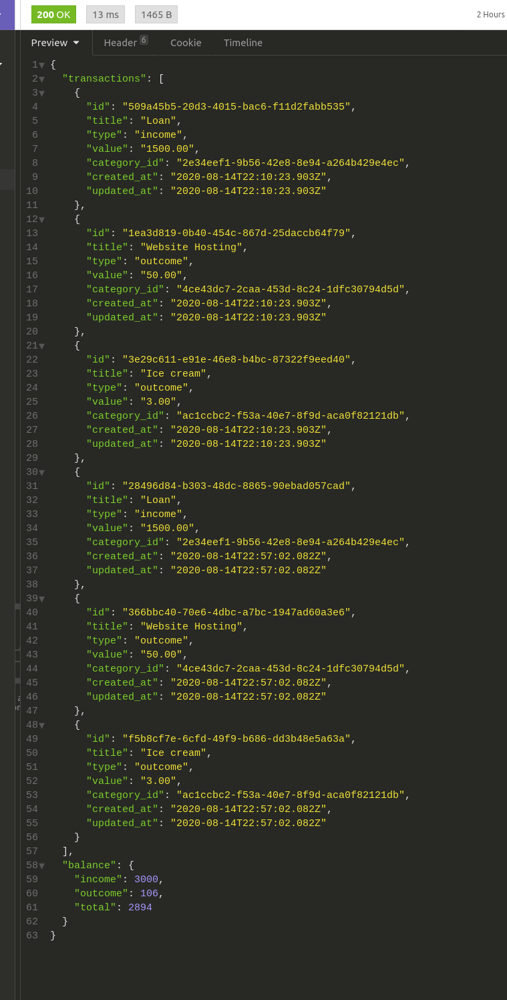

<h2 align="center">
  Desafio 06: Primeiro projeto Node.js :flying_saucer:
</h2>

  <a href="#rocket-desafio">Desafio</a>&nbsp;&nbsp;&nbsp;|&nbsp;&nbsp;&nbsp;
  <a href="#artificial_satellite-tecnologias">Tecnologias</a>&nbsp;&nbsp;&nbsp;|&nbsp;&nbsp;&nbsp;
  <a href="#gear-funcionalidades">Funcionalidades</a>&nbsp;&nbsp;&nbsp;|&nbsp;&nbsp;&nbsp;
  <a href="#memo-testes">Testes</a>&nbsp;&nbsp;&nbsp;|&nbsp;&nbsp;&nbsp;
  <a href="#computer-como-contribuir">Como contribuir</a>&nbsp;&nbsp;&nbsp;|&nbsp;&nbsp;&nbsp;
  <a href="#file_folder-licença">Licença</a>

 

## :rocket: Desafio

O objetivo desse desafio foi continuar desenvolvendo a aplicação de gestão de transações, treinando o que se aprendeu até agora no Node.js junto ao TypeScript, porém incluindo o uso de banco de dados com o TypeORM e envio de arquivos com o Multer!

Essa aplicação deve armazenar transações financeiras de entrada e saída e permitir o cadastro e a listagem dessas transações, além de permitir a criação de novos registros no banco de dados a partir do envio de um arquivo csv.

## :artificial_satellite: Tecnologias

Esse projeto foi desenvolvido com as seguintes tecnologias:

- [Node.js](https://nodejs.org/en/)
- [React](https://reactjs.org)
- [Express](https://expressjs.com/)
- [Javascript](https://www.javascript.com/)
- [Typescript](https://www.typescriptlang.org/)
- [Outras](#)

## :gear: Funcionalidades

Como funcionalidades da aplicação, temos:

- POST: A rota deve receber saldo de entrada (salário, depósitos, ...), saídas (retiradas, compras, ...), e o tipo da transação. A aplicação não deve permitir a criação de nenhuma transação, se o total em conta for insuficiente.

- GET: Essa rota deve listar todas as transações cadastradas, junto com o valor de soma de entradas, retiradas e total de crédito.

- DELETE (/transactions/:id): Utilizar o ID da transação para pode excluir a transação, caso ela exista.

- POST (/transactions/import): Permitir a criação de novos registros no banco de dados a partir do envio de um arquivo csv.

<h4><strong>A rota deve retornar um objeto com o seguinte formato:</strong></h4>

<h4 display="flex" align="center">
    
</h4>

## :memo: Testes
 Em cada teste aplicado nesse desafio há uma breve descrição sobre quais quesitos a aplicação deve cumprir para que o teste passe:

<strong> should be able to create a new transaction: </strong>
Para que esse teste passe, sua aplicação deve permitir que uma transação seja criada, e retorne um json com a transação criada.

<strong> should create tags when inserting new transactions: </strong>
Para que esse teste passe, sua aplicação deve permitir que ao criar uma nova transação com uma categoria que não existe, essa seja criada e inserida no campo category_id da transação com o id que acabou de ser criado.

<strong> should not create tags when they already exists: </strong>
Para que esse teste passe, sua aplicação deve permitir que ao criar uma nova transação com uma categoria que já existe, seja atribuído ao campo category_id da transação com o id dessa categoria existente, não permitindo a criação de categorias com o mesmo title.

<strong> should be able to list the transactions: </strong>
Para que esse teste passe, sua aplicação deve permitir que seja retornado um array de objetos contendo todas as transações junto ao balanço de income, outcome e total das transações que foram criadas até o momento.

<strong> should not be able to create outcome transaction without a valid balance: </strong>
Para que esse teste passe, sua aplicação não deve permitir que uma transação do tipo outcome extrapole o valor total que o usuário tem em caixa (total de income), retornando uma resposta com código HTTP 400 e uma mensagem de erro no seguinte formato: { error: string }.

<strong> should be able to delete a transaction: </strong>
Para que esse teste passe, você deve permitir que a sua rota de delete exclua uma transação, e ao fazer a exclusão, ele retorne uma resposta vazia, com status 204.

<strong> should be able to import transactions: </strong>
Para que esse teste passe, sua aplicação deve permitir que seja importado um arquivo csv, contendo o seguinte modelo. Com o arquivo importado, você deve permitir que seja criado no banco de dados todos os registros e categorias que estavam presentes nesse arquivo, e retornar todas as transactions que foram importadas.

## :computer: Como contribuir
- Faça um fork desse repositório;
- Cria uma branch com a sua feature: git checkout -b minha-feature;
- Faça commit das suas alterações: git commit -m 'feat: Minha nova feature';
- Faça push para a sua branch: git push origin minha-feature.
- Depois que o merge da sua pull request for feito, você pode deletar a sua branch.

## :file_folder: Licença
Esse projeto está sob a licença MIT. Veja o arquivo [LICENSE](LICENSE.md) para mais detalhes.

 

#### 
#usemascara :mask: 

